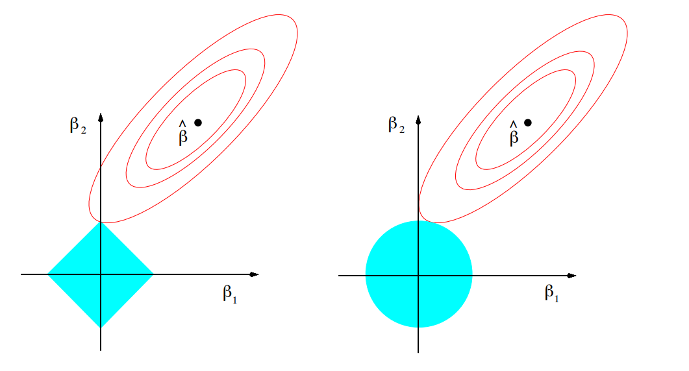
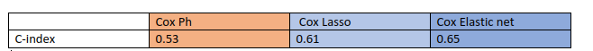

```{r setup, include=FALSE}
knitr::opts_chunk$set(echo = FALSE)
```

## Outline
\tableofcontents[hideallsubsections]


# Background: What is wrong with regression analysis of higher dimensions data?

## Background

We start with a regular regression problem

-   Consider i.i.d. samples $\left(x_i, y_i\right) \in \mathbb{R}^p \times \mathbb{R}, i=1, \ldots, n$ from the linear model

-   We can express a model as

```{=tex}
\begin{align}
y=X \beta+\epsilon
\end{align}
```
> > $y=\left(y_1, \ldots, y_n\right) \in \mathbb{R}^n$, $X \in \mathbb{R}^{n \times p}$, $\epsilon=\left(\epsilon_1, \ldots, \epsilon_n\right) \in \mathbb{R}^n$

-   Several different sets of assumptions can be put here, (i.e. $\epsilon$ are Normally distributed, etc)

## Background (continued)

-   We can estimate vector $\beta$ using OLS (Ordinary Least Square) or Maximum Likelihood Estimation:

```{=tex}
\begin{align}
&\min _{\beta \in \mathbb{R}^p} \sum_{i=1}^n\left(y_i-x_i^T \beta\right)^2 \Longleftrightarrow \notag\\
&\min _{\beta \in \mathbb{R}^p} \sum_{i=1}^n\left(y_i-\sum_{j=1}^p \beta_j X_j\right)^2 \Longleftrightarrow \notag\\
&\min _{\beta \in \mathbb{R}^p}\|y-X \beta\|_2^2
\end{align}
```
-   OLS estimate would be:

```{=tex}
\begin{align}
\hat{\beta}_{OLS}=\left(X^T X\right)^{-1} X^T y
\end{align}
```
> Under regular assumptions, Gauss--Markov theorem show OLS estimator is **BLUE** (Best Linear Unbiased Estimator)

## Failure in high dimensions

Most classical approaches work when $n>p$ in $X_{n\times p}$ but...Not all datasets have similar structures!

-   Lack of interpretability: when $p$ is large we may prefer a smaller set of predictors to determine those most strongly associated with $y$

    -   Going back to the solution to Least squares (equation (3)), $\hat{\beta}_{OLS}=\left(X^T X\right)^{-1} X^T y$, if Rank($X$)$<p$, $\hat{\beta}$ does not have a unique representation!

-   Large variability: when $p$ is large relative to $n$, or when columns in our design matrix are highly correlated, variance of parameter estimates is large

-   Issues with prediction: While the fitted value is unique regardless of Rank($X$), in terms of actual predictions at say a new point $x_0 \in \mathbb{R}^p$, it will not generally be the case that $x_0^T \tilde{\beta}=x_0^T \hat{\beta}$ for two solutions $\hat\beta, \tilde{\beta}$. So which one should be our prediction?

## What to do in higher dimensions?

-   Principle Component Regression: The idea of PCR can be traced back to [@PCR1] and [@PCR2]. idea is:

    1.  Perform PCA on the observed data matrix for the explanatory variables to obtain the principal components

    2.  Now regress the observed vector of outcomes on the selected principal components as covariates, using OLS regression to get a vector of estimated regression coefficients.

-   Penalty/Shrinkage/Regularized Methods

    -   Idea is to penalize coefficients the further they go from zero
    -   We change the Likelihood function/ Objective function and add a penalty term. In case of regression:

```{=tex}
\begin{align}
&\min _{\beta \in \mathbb{R}^n}\|y-X \beta\|_2^2 \text { subject to } \beta \in C \notag\\
&\min _{\beta \in \mathbb{R}^n}\|y-X \beta\|_2^2+Pen(\beta) 
\end{align}
```
## Penalized regression

Lets define three norms $\ell_0, \ell_1, \ell_2$ as:

$$\|\beta\|_0=\sum_{j=1}^p 1\left\{\beta_j \neq 0\right\} . \quad\|\beta\|_1=\sum_{j=1}^p\left|\beta_j\right|, \quad\|\beta\|_2=\left(\sum_{j=1}^p \beta_j^2\right)^{1 / 2}$$

then we can look at our regression problem with a penalty in three ways:

1.  $\min _{\beta \in \mathbb{R}^p} \frac{1}{2}\|y-X \beta\|_2^2+\lambda\|\beta\|_0$ (known as best subset selection [@l0])

2.  $\min _{\beta \in \mathbb{R}^p} \frac{1}{2}\|y-X \beta\|_2^2+\lambda\|\beta\|_1$ (known as LASSO [@l1])

3.  $\min _{\beta \in \mathbb{R}^p} \frac{1}{2}\|y-X \beta\|_2^2+\lambda\|\beta\|_2^2$ (known as ridge regression [@l2])

$\lambda$ controls the trade-off between the penalty and the fit.

## LASSO vs Ridge

```{r echo=FALSE, out.width='100%',fig.cap="\\label{fig:figs}The “classic” illustration comparing lasso and ridge constraints. From Chapter 3 of (Hastie, et al 2009)"}

```

# Time-to-event data: how to deal with high dimensions in survival analysis

## Time-to-event data

Statistical methods to study not only if  an event happens but also **when** it happens.

-   Time is measured for each person from the first observation until when an **event happens** (aka failure) or when **time is censored**.
    -   Cause of censoring: The study is out of time/money, A person is lost to follow-up or dies from other causes, etc.
-   We are interested in predicting the survival time or instantaneous failure rate at time $t$ (aka hazard function $\lambda(t)$)

**Goal**: Compare two or more groups, adjusting for other risk factors on survival times (like Multiple regression) with $p$ features and we want to model Relative Risk of the event as function of time and covariates

-   Logistic regression can predict the presence or absence of events but not time until events and it can not handle time dependent covariates.

-   Linear regression can not handle censoring well or time-dependent covariates or the fact that time can only be positive

## Proportional Hazard Model

[@Cox] proposed this method:

Consider the usual survival data setup:$\left(t_1, \textbf{x}_1, \delta_1\right) \ldots$. $\left(t_N, \textbf{x}_N, \delta_N\right)$. Denote the distinct failure times by $t_1<\cdots<t_k$, there being $d_i$ failures at time $t_i$.

The proportional-hazards model for survival data, also known as the Cox model, assumes that

$$
\lambda(t \mid \mathbf{x})=\lambda_0(t) \exp \left(\sum_j x_j \beta_j\right)
$$ 
$\boldsymbol \beta$ is found by maximizing the partial likelihood:

$$
L(\boldsymbol{\beta})=\prod_{\boldsymbol{r} \in D} \frac{\exp \left(\boldsymbol{\beta}^{\mathrm{T}} \mathbf{x}_{j_r}\right)}{\left\{\sum_{j \in R_r} \exp \left(\boldsymbol{\beta}^{\mathrm{T}} \mathbf{x}_j\right)\right\}}
$$

**Issue**: Similar to linear regression, this won't work properly when $p>n$.

## LASSO for Cox Model

[@LASSOCOX] introduced LASSO method for variable selection in the Cox model. We change the maximization of the partial Cox log-likelihood to:

$$
\hat{\beta}(s)=\operatorname{argmax} \ell(\beta)  \quad \text { subject to } \sum_{j=1}^p\left|\beta_j\right| \leq s .
$$

(0) Define $\eta=\beta'x, \mu=\partial l/\partial \eta, A=-\partial^2 l/\partial \eta\eta^T$, $z= \eta+ A^{-}\mu$, $y=A^{1/2}z$ and $\hat{x}=A^{1/2}x$.
(1) Fix $s$ and initialize $\hat{\beta}$.
(2) Compute everything defined in step 0 based on the current value of $\hat{\beta}$.
(3) Minimize $\left(y-\beta^{\prime} \hat x\right)^T\left(y-\beta^{\prime} \hat x\right)$ subject to $\sum\left|\beta_j\right| \leq s$.
(4) Repeat step 2 and 3 until $\hat{\beta}$ does not change.

$s$ is chosen by CV.

## Elastic net for Cox Models

[@EnetCox] introduce Elastic net for Cox Models by mixing the $\ell_1$ and $\ell_2$ penalties and changing the constraint term to:

$$\hat{\beta}(s)=\operatorname{argmax} \ell(\beta)  \quad \text { subject to }\alpha \sum_{j=1}^p\left|\beta_i\right|+(1-\alpha) \sum_{j=1}^p \beta_i^2 \leq c$$

1.  Initialize $\tilde{\beta}$, and set $\tilde{\eta}=X \tilde{\beta}$.

2.  Compute $\ell^{\prime \prime}(\tilde{\eta})$, and $z(\tilde{\eta})=\tilde{\eta}-\ell^{\prime \prime}(\tilde{\eta})^{-1} \ell^{\prime}(\tilde{\eta})$.

3.  Find $\widehat{\beta}$ minimizing

$$
\frac{1}{n} \sum_{i=1}^n w(\tilde{\eta})_i\left(z(\tilde{\eta})_i-x_i^{\top} \beta\right)^2+\lambda P_\alpha(\beta)
$$

4.  Set $\tilde{\beta}=\hat{\beta}$ and, $\tilde{\eta}=X \widehat{\beta}$.

5.  Repeat steps $2-4$ until convergence of $\widehat{\beta}$.


## Issue with cross-validation

Solution: Harrell's C-index [@cindex] 

For subject $i$ with risk score $\eta_i$ and $T_i$ survival time:

1. If both $T_i$, and $T_j$ are not censored, we say that the pair $(i, j)$ is a concordant pair if $\eta_i>\eta_j$ and $T_i<T_j$, and it is a discordant pair if $\eta_i>\eta_j$ and $T_i>T_j$.

2. If both $T_i$ and $T_j$ are censored, we don't consider this pair in the computation.

3. If $T_i$ is not censored and $T_j$ is censored:
   + If $T_j<T_i$, we don't consider this pair in the computation.
   + If $T_j>T_i$,  $(i, j)$ is a concordant pair if $\eta_i>\eta_j$ and is a discordant pair if $\eta_i<\eta_j$.

Harrell's C-index is simply:

$$
c=\frac{\text { \# concordant pairs }}{\text { \# concordant pairs }+\text { \# discordant pairs }}
$$

# Result on Gene-expression data

## Comparison on Real data

- (Alizadeh et al 2000): Gene-expression data in lymphoma patients.
   + There were 240 patients with measurements on 7399 genes
   + 140 censored observation

```{r echo=FALSE, ,out.width="89%",out.height="10%"}

```   


```{r echo=FALSE, ,out.width="49%",out.height="40%",fig.cap="caption",fig.show='hold',fig.align='center',fig.cap="\\label{fig:figs}Left plot shows the result of Cross validation with LASSO and the right plot shows the result of cross validation using elastic net"}
knitr::include_graphics(c('CVLASSO.png',"CVnet.png"))
```   


## Conclusion

- One method for overcoming the issues of high dimensionality in Cox models is shrinkage

- We introduce LASSO and Elastic nets for Cox model. 
   + The lasso penalty [@LASSOCOX]  tends to choose only a few nonzero coefficients.
   + Ridge regression scales all the coefficients towards 0, but sets none to exactly zero.
   + The elastic net combines the strengths of the two approaches by mixing the penalty terms

- Downside of penalized Cox model in general is the computational cost. Another downside is difficulty of tuning the penalty parameter using cross validation.   

## Thank you!

The codes and slides will be posted on my Github account:

https://fredazizi.github.io/

## References {.allowframebreaks}


